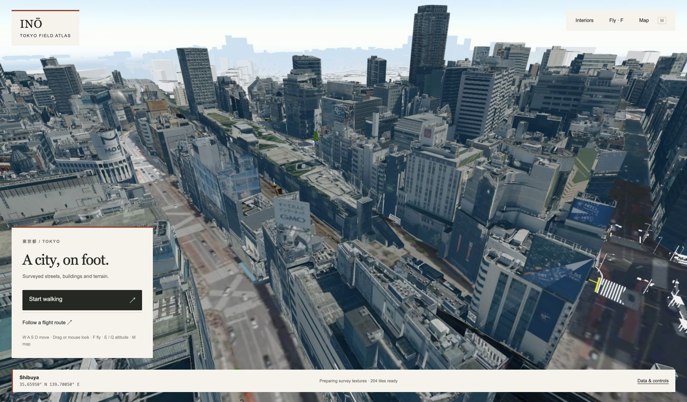

# Inō · Tokyo

A georeferenced 3D explorer for Tokyo built with Three.js, PLATEAU city models, and GSI terrain and aerial imagery. Walk or fly through streamed survey geometry, visit selected Shibuya interiors, and inspect published underground scans.



The name refers to [Inō Tadataka’s field surveys](https://www.ndl.go.jp/en/jikihitsu/part1/s3_3/). The interface takes its paper palette, ruled margins and compact annotations from [historic survey sheets](https://www.loc.gov/resource/gdcwdl.wdl_11823/), while the city data remains modern.

## Run locally

Requires Node.js 22.18 or later, Python 3.10 or later for asset setup, a WebGL2 browser, and internet access for government data services. Tested on Apple Silicon macOS with Node.js 25.9.0.

```sh
npm ci
python3 scripts/setup_assets.py
npm run build
npm start
```

Open **http://127.0.0.1:5173/**. Asset setup downloads a checksum-verified 511 MB release archive and installs 664 MB under `public/`. The archive contains the local interiors, scans, textures, decoder files, and data manifests. City tiles and imagery stream separately; this is not an offline copy of Tokyo.

Use `npm start` for the complete viewer. The development server provides only part of the local data API. On macOS, `Start Tokyo.command` launches the built site after setup.

| Control | Action |
| --- | --- |
| WASD / arrow keys | Move |
| Mouse or drag | Look |
| Shift | Move faster |
| F | Switch walking / flight |
| E / Q | Ascend / descend in flight |
| E | Enter a nearby supported interior or interact |
| M | Destination map |
| Esc | Pause / release mouse |

## Implementation

- `src/buildings.ts`, `src/compressed-tiles.ts`: camera-directed 3D Tiles loading and texture handling.
- `src/terrain.ts`, `src/ground-imagery.ts`: streamed elevation and imagery, source alignment, and texture residency.
- `src/source-collision.ts`, `src/tile-preparation.ts`: survey-triangle collision indexes and staged tile preparation.
- `src/neighborhood.ts`, `src/interior-world.ts`: selected Shibuya entrances, furnished interiors, and interactions.
- `server.mjs`, `scripts/ortho-service.mjs`: bounded local tile-conversion and orthophoto worker queues.
- [`native/`](native/README.md): an Unreal 5.8 source port with a pinned PLATEAU SDK patch. It has not been compiled or runtime-verified.

One scene unit represents one metre. The source catalogue connects 62 Tokyo municipalities, including the western mainland and islands. Coverage, detail, and photography dates vary with the source data. The furnished interiors and added street objects are authored interpretations, identified separately from surveys. The original complete-city reproduction goal remains unfinished.

## Optional imagery tools

Python image packages enable native Tokyo orthophoto reprojection and texture conversion on macOS/Linux:

```sh
python3 -m venv .venv
.venv/bin/python -m pip install -r scripts/requirements.txt
```

The server uses `.venv/bin/python` when available, or `TOKYO_PYTHON` to select another interpreter. Texture conversion additionally needs `basisu` on `PATH`, or `TOKYO_TEXTURE_ENCODER` pointing to `basisu` or `toktx`. Without a working encoder, the server returns original survey tile bytes. The 20 cm orthophoto route requires the Python dependencies; standard streamed city data does not.

Blender authoring and capture-conversion scripts require their separately supplied source inputs. They are not part of the startup sequence. The earlier film and music are not distributed with this repository.

## Tests

```sh
npm test
python3 -m unittest discover -s tests -p 'test_*.py'
npm run build
```

Tests cover coordinate scale, geometry and collision, terrain and imagery handling, flight motion, interior interactions, and worker queue lifecycle. Passing these checks does not establish complete geographic fidelity or interactive performance across Tokyo.

## Data and licenses

Project code is [MIT licensed](LICENSE). Third-party data and decoder software retain their own terms. See [THIRD_PARTY_NOTICES.md](THIRD_PARTY_NOTICES.md) and the attribution manifests distributed with the assets.

- [PLATEAU city data](https://docs.plateauview.mlit.go.jp/datasets/3d-tiles/)
- [GSI terrain and imagery](https://maps.gsi.go.jp/development/ichiran.html)
- [Tokyo Digital Twin orthophotography](https://catalog.data.metro.tokyo.lg.jp/dataset/t000029d0000000020)
- [OpenStreetMap contributors](https://www.openstreetmap.org/copyright)
- [3D City Experience Lab. survey data](https://3dcel.com/opendata/)
- [Poly Haven materials](https://polyhaven.com/license)
